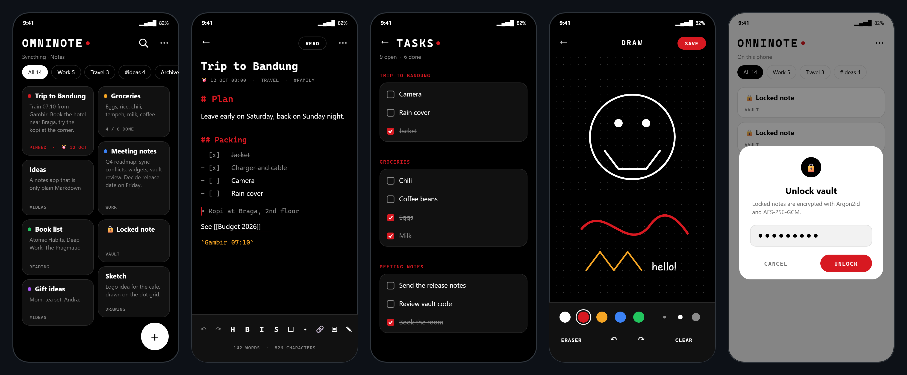

# OmniNote

A quiet, private notes app for Android in the Nothing style: black, white and one red dot.

OmniNote brings together the best ideas of four open-source projects, **nothing.notes**, **Scarlet Notes**, **Notesnook** and **Syncthing**, rewritten from scratch in pure Kotlin as one small app.

Your notes are plain Markdown files. You own them, any app can read them, and nothing ever leaves your phone unless you sync it yourself.

<p align="center">
  
</p>
<p align="center"><sub>NOTES · EDITOR · TASKS · DRAWING · VAULT (light theme). Interface previews drawn from the app's UI; the notes are examples.</sub></p>

## Features

### Writing
- Live Markdown editor: headings, bold, italic, strikethrough, code, quotes, lists, checklists, tables, links and dividers
- Read mode with tappable checklists, links between notes (`[[Note title]]`) and images
- Free-hand drawing on a black dot-grid canvas, saved into the note and editable later
- Table of contents, word and character count, merge several notes into one
- Version history: older versions of every note are kept on the phone and can be restored

### Organising
- Notebooks and sub-notebooks (plain folders), tags, seven colours, pin, archive and trash
- Search with recent searches, grid or list view, four sort orders, adjustable preview lines and text size
- Tasks screen that collects every checklist item from all notes

### Reminders and quick access
- Reminders that ring on time (also after a restart), and notes pinned to the notification panel
- Home screen widgets: a quick-note bar and a widget that shows one note
- "New note" button in Quick Settings and launcher shortcuts (new note, new checklist, tasks)
- Share text from any app into a new note

### Security
- Vault: lock individual notes with a password, encrypted with Argon2id and AES-256-GCM
- App lock with your fingerprint, face, PIN or pattern

### Sync, import and export
- Sync between phones and computers with [Syncthing](https://syncthing.net), including detection and resolution of sync conflicts
- Works side by side with [Obsidian](https://obsidian.md) and any other Markdown app
- Import from Scarlet Notes backups, Notesnook Markdown exports, Obsidian folders, ZIP archives and plain Markdown or text files
- Export all notes as a ZIP, or one note as Markdown, a web page or a PDF
- Automatic daily backups to a folder you choose

## Install

OmniNote needs Android 8.0 or newer.

- **Obtainium:** add `https://github.com/andrasulthan-alt/OmniNote`
- **Komi Store:** [github-store.org/app?repo=andrasulthan-alt/OmniNote](https://github-store.org/app?repo=andrasulthan-alt/OmniNote)
- **Manual:** download the latest APK from [Releases](https://github.com/andrasulthan-alt/OmniNote/releases)

Every release is signed with the same key, so updates install over the previous version without uninstalling.

## Sync with Syncthing

OmniNote has no servers and no internet access. To keep notes in sync between devices:

1. Install Syncthing on each device. On Android, use [Syncthing-Fork](https://github.com/researchxxl/syncthing-android).
2. In OmniNote, open **⋯ → Choose notes folder…** and pick a folder such as `Documents/OmniNote`. OmniNote offers to copy your existing notes there.
3. In Syncthing, share that folder with your other devices.

OmniNote refreshes by itself when Syncthing brings changes. If a note was changed on two devices at once, it appears under the **Conflicts** filter, where you can keep either version or merge both.

## Privacy

- Only two permissions: notifications (for reminders) and starting after a reboot (to restore reminders)
- No internet permission, no accounts, no analytics, no ads and no trackers
- Android cloud backup is turned off; your notes stay where you put them
- The keyboard is asked not to learn from what you type

## Folder layout

```
Notes folder/
├── My note.md              a note: Markdown with a small YAML header
├── Work/                   a notebook
│   └── Ideas/              a sub-notebook
├── attachments/            images and drawings
├── .trash/                 deleted notes
└── .omninote/              shared settings, such as the vault check
```

## Credits

OmniNote is an independent project. Its code is new, but it would not exist without these projects and their authors:

| Project | Author | License | Ideas used in OmniNote |
|---|---|---|---|
| [nothing.notes](https://github.com/ThriveEngineer/nothing.notes) | ThriveEngineer | MIT | Nothing OS look, dot-matrix style, tasks, notifications |
| [Scarlet Notes](https://github.com/Fs00/Scarlet-Notes) | BijoySingh, Fs00 | GPL-3.0 | Notebooks, colours, pin and archive, widgets, quick notes, backup format |
| [Notesnook](https://github.com/streetwriters/notesnook) | Streetwriters | GPL-3.0 | Rich Markdown editing, vault, reminders, merging, version history |
| [Syncthing](https://github.com/syncthing/syncthing) | The Syncthing Foundation | MPL-2.0 | File-based notes that sync without a server |

The vault uses Argon2id as specified in [RFC 9106](https://www.rfc-editor.org/rfc/rfc9106), implemented in pure Java and checked against the official test vector.

## License

OmniNote is free software, released under the [GNU General Public License v3.0](LICENSE).
